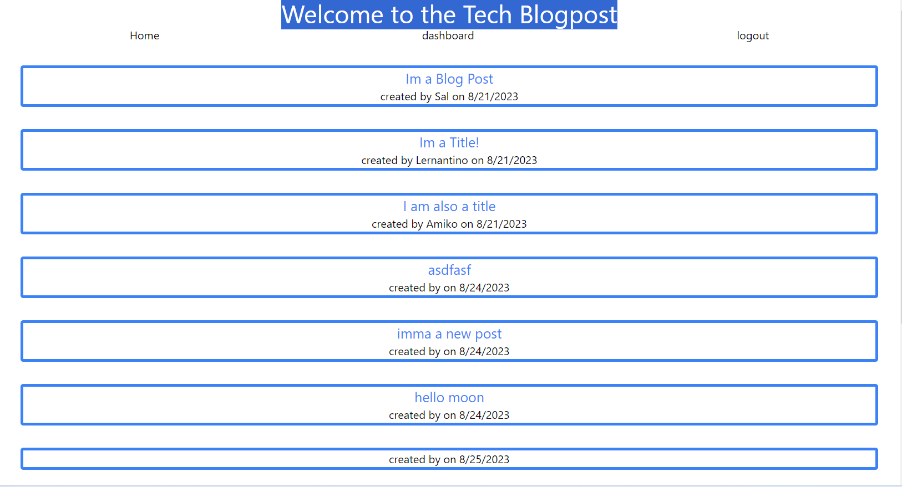
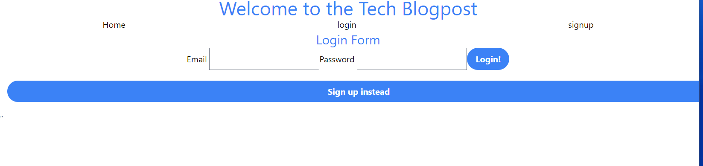
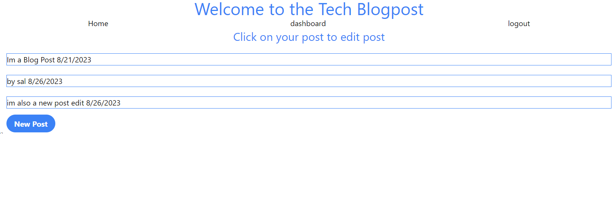

# Tech Blog 
## Description
This project is a blog post site in which users can create accouts, make blogpost and comment on the blogpost. Users from their home dashboard can edit and delete post.

## Table of Contents
- [Installation](#installation)
- [Questions](#questions)
- [License](#license)
- [Links](#links)
- [Screenshots](#screenshots)

## Installation
Just visit https://safe-stream-61726-216214b7671d.herokuapp.com/

## Questions
If you have any questions, please contact me at [email](mailto:Kevin.donnelly3@gmail.com). You can also visit my [GitHub profile](https://github.com/Kdonnelly33) to view more of my work.

## License
This project uses the MIT license.
For more information, visit https://opensource.org/licenses/MIT.

## Links
- [GitHub Repo](https://github.com/KDonnelly33/tech_blog)
- [Deployed App](https://safe-stream-61726-216214b7671d.herokuapp.com/)

## Screenshots

